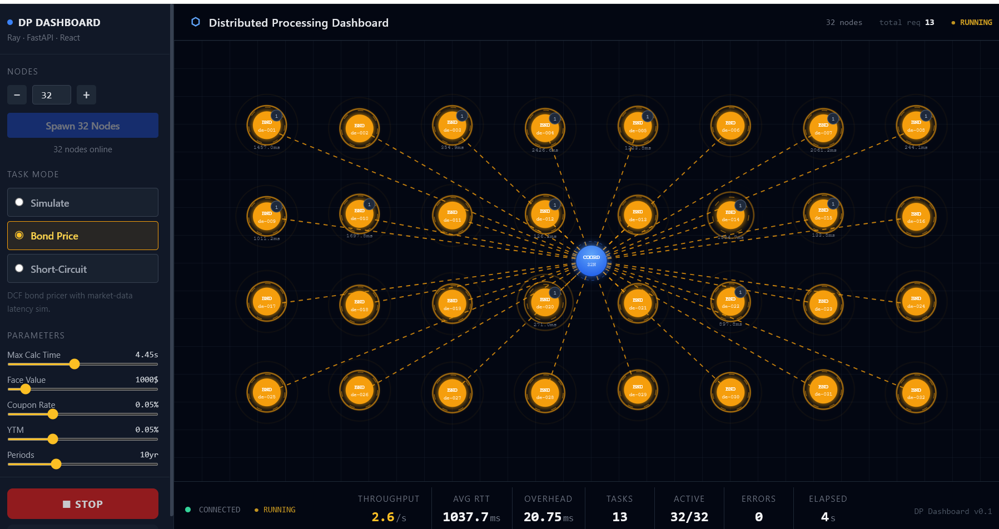
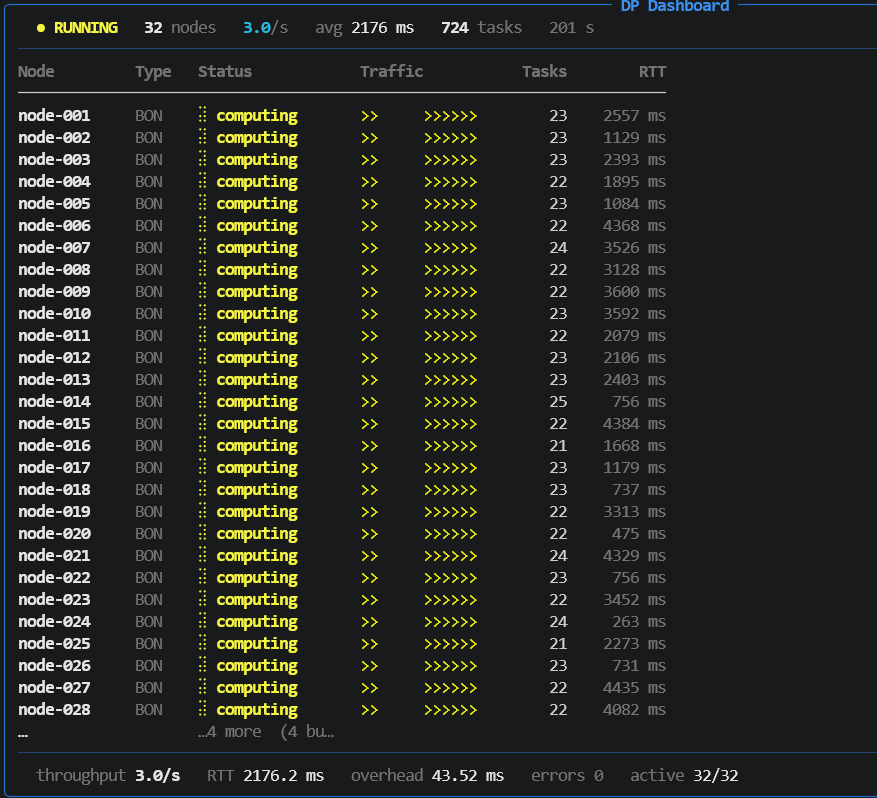

# Distributed Processing Dashboard

A real-time distributed processing visualizer built on **Dask**, **FastAPI**, and **React**. Spawn worker nodes from a browser dashboard, choose a task mode, hit **Run**, and watch the cluster animate — with live throughput, round-trip time, and overhead stats updating at 10 Hz.

### Daskboard

### Backend


---

## Table of Contents

1. [Architecture Overview](#architecture-overview)
2. [Repository Layout](#repository-layout)
3. [Tech Stack](#tech-stack)
4. [Getting Started](#getting-started)
5. [Dashboard Tour](#dashboard-tour)
6. [Task Modes](#task-modes)
7. [Stats Explained](#stats-explained)
8. [API Reference](#api-reference)
9. [WebSocket Protocol](#websocket-protocol)
10. [Extending with New Task Types](#extending-with-new-task-types)
11. [Design Decisions](#design-decisions)
12. [Known Limitations](#known-limitations)

---

## Architecture Overview

```
Browser (React)
    │   WebSocket (10 Hz state push)
    │   REST (spawn / run / stop / reset)
    ▼
FastAPI  (port 8000)
    │
    ├── ClusterManager
    │       │  asyncio task per worker
    │       │  Dask futures via asyncio.to_thread
    │       ▼
    │   Dask LocalCluster  (thread-based workers)
    │       ├── Worker A  ←── process_task("simulate", params)
    │       ├── Worker B  ←── process_task("bond_price", params)
    │       └── Worker N  ←── process_task("short_circuit", params)
    │
    └── WebSocket broadcaster (asyncio task, 100 ms interval)
```

**Data flow when you click Run:**

1. `ClusterManager._run_loop` checks each worker address; if its asyncio wrapper task is done, it submits a new Dask future via `client.submit(..., workers=[addr])`.
2. `ClusterManager._handle` awaits the future in a dedicated asyncio task; on completion it updates per-node state and records stats.
3. The broadcast loop serialises the full cluster state to JSON and pushes it to every connected WebSocket client.
4. React re-renders `NodeCanvas` with the new node states and animates accordingly.

The loop repeats immediately — every worker is kept continuously busy as long as Run is active.

---

## Repository Layout

```
C:\dev\tech\DP\
├── requirements.txt              Python dependencies
├── CLAUDE.md                     AI-assistant instructions for this repo
├── README.md                     This file
│
├── src/
│   ├── backend/
│   │   ├── __init__.py
│   │   ├── main.py               FastAPI app, REST endpoints, /ws WebSocket
│   │   ├── cluster.py            ClusterManager, ClusterStats, Dask lifecycle
│   │   └── workers.py            process_task() + all task implementations
│   │
│   └── frontend/
│       ├── index.html
│       ├── package.json
│       ├── vite.config.ts        Dev proxy: /api → :8000, /ws → ws://:8000
│       ├── tsconfig.json
│       ├── tailwind.config.js
│       ├── postcss.config.js
│       └── src/
│           ├── main.tsx          React entry point
│           ├── App.tsx           Root: WebSocket client + API calls + layout
│           ├── index.css         Tailwind base + SVG keyframe animations
│           ├── types.ts          Shared TypeScript types
│           └── components/
│               ├── NodeCanvas.tsx   SVG hub-and-spoke animated canvas
│               ├── Controls.tsx     Left sidebar (spawn, mode, params, run)
│               └── StatsPanel.tsx   Bottom stats bar
│
└── tests/
    └── test_workers.py           Unit tests for task logic (no Dask required)
```

---

## Tech Stack

| Layer | Technology | Why |
|---|---|---|
| Distributed processing | **Dask 2024+** | Python 3.13-compatible, thread-based workers avoid Windows `spawn` pickling edge cases, scheduler/future model maps directly to the node-dispatch pattern |
| API server | **FastAPI + uvicorn** | Native `async`/`await`, WebSocket support built-in, Pydantic request validation |
| Real-time push | **WebSocket** (native) | 10 Hz server push; no polling, no SSE backpressure issues |
| Frontend | **React 18 + TypeScript** | Hooks make the stateful WebSocket subscription clean |
| Build | **Vite 5** | Sub-second HMR; dev proxy routes `/api` and `/ws` to the backend |
| Styling | **Tailwind CSS v3** | Utility-first; dark theme with zero custom CSS except SVG keyframes |
| Node canvas | **SVG + CSS animations** | No canvas library dependency; declarative layout with hub-and-spoke geometry; `@keyframes` for pulse rings, flowing dash lines, and float oscillation |

---

## Getting Started

### Prerequisites

- Python 3.10–3.13
- Node.js 18+

### 1 – Clone and prepare Python environment

```powershell
cd C:\dev\tech\DP
python -m venv .venv
.\.venv\Scripts\pip install -r requirements.txt
```

### 2 – Start the backend

```powershell
.\.venv\Scripts\uvicorn src.backend.main:app --reload --port 8000
```

You should see:

```
INFO:     Uvicorn running on http://127.0.0.1:8000
```

### 3 – Start the frontend (separate terminal)

```powershell
cd src\frontend
npm install
npm run dev
```

Open **http://localhost:5173** in your browser.

### 4 – Run the unit tests

```powershell
cd C:\dev\tech\DP
.\.venv\Scripts\python -m pytest tests/ -v
```

All 5 tests exercise the task math without requiring a running Dask cluster.

---

## Dashboard Tour

```
┌─────────────────────────────────────────────────────────────────────┐
│ ⬡ Distributed Processing Dashboard        8 nodes   ● RUNNING      │
├────────────────┬────────────────────────────────────────────────────┤
│                │                                                     │
│  Nodes         │          SVG Node Canvas                           │
│  [ 4 ] − +     │                                                     │
│  [Spawn 4]     │   ○ ── ○       Each circle = one Dask worker       │
│                │    \ │ /       Computing nodes pulse amber          │
│  Task Mode     │   [COORD]      with flowing dashed lines           │
│  ● Simulate    │    / │ \       Done nodes flash green               │
│  ○ Bond Price  │   ○   ○        All nodes float (breathing anim.)   │
│  ○ Short-Circ  │       ○                                            │
│                │                                                     │
│  Max Calc: 2s  │                                                     │
│  ──────────── │                                                     │
│                │                                                     │
│  [ ▶ RUN ]    │                                                     │
│  [RESET CLSTR] │                                                     │
├────────────────┴────────────────────────────────────────────────────┤
│ ● CONNECTED  ● RUNNING │Throughput│Avg RTT│Overhead│Tasks│Active│…  │
└─────────────────────────────────────────────────────────────────────┘
```

### Controls panel (left sidebar)

| Control | Description |
|---|---|
| Node count `− N +` | How many workers to spawn in the next Spawn call (1–32) |
| **Spawn N Nodes** | Creates N new Dask thread workers; adds them to the canvas |
| Task Mode | Select the computation to run on every worker (see [Task Modes](#task-modes)) |
| Max Calc Time | Upper bound on simulated latency for Simulate and Bond Price modes |
| Bond price params | Face value, coupon rate, YTM, periods (visible in Bond Price mode only) |
| **▶ RUN** | Starts continuous task dispatch; button switches to **■ STOP** |
| **■ STOP** | Cancels all in-flight futures; workers return to idle |
| **RESET CLUSTER** | Destroys the Dask cluster and all workers; canvas clears |

### Node canvas (center)

Nodes are arranged in a hub-and-spoke layout centred on the **COORD** (coordinator / scheduler) node:

- Up to 10 workers → single ring
- 11–22 workers → two concentric rings (inner 8, rest outer)
- 23+ workers → auto grid

Each node displays:
- **Icon** — task type abbreviation (`SIM`, `BND`, `SC`)
- **Short ID** — last 6 chars of the worker address (port number)
- **Badge** — completed task count (top-right corner)
- **RTT** — last round-trip time in ms (below the circle)

Node states and their visual treatment:

| State | Fill | Animation |
|---|---|---|
| `idle` | Gray `#374151` | Slow float oscillation (phase-offset per node) |
| `computing` | Amber `#f59e0b` + glow filter | Two expanding pulse rings + spinning dashed orbit ring + flowing dashed line to COORD |
| `done` | Green `#10b981` + glow filter | Brief green flash before next task is dispatched |
| `error` | Red `#ef4444` | Static red until next task attempt |

---

## Task Modes

### Simulate

```
Calc time = uniform(0, max_calc_time) seconds
```

Sleeps for a random duration. Use this to model heterogeneous workload distributions and see how the scheduler balances work. The default `max_calc_time` of 2 s gives visible animation; drop it to 0.05 s for throughput stress-testing.

### Bond Price

Implements the standard fixed-coupon bond DCF pricing formula:

```
Price = Σ [C / (1+r)^t] + F / (1+r)^n
```

Where `C = face × coupon_rate / freq`, `r = ytm / freq`, `n = periods × freq`.

Also computes **modified duration**:

```
ModDur = MacaulayDuration / (1 + r)
```

A random market-data lookup latency is simulated via `sleep(uniform(0, max_calc_time))`. The formula is identical to QuantLib's `DiscountingBondEngine` for a `FixedRateBond` — plug in real QuantLib calls in `_bond_price()` in `workers.py` to price against an actual yield-curve.

### Short-Circuit

Returns immediately with `{"value": 0, "calc_time": 0.0}`. Every millisecond of RTT you observe in this mode is **pure framework overhead** — Dask scheduling latency + asyncio task switching + WebSocket serialisation. Use this to baseline the system before adding real computation.

---

## Stats Explained

All metrics shown in the bottom stats bar:

| Metric | Formula | Meaning |
|---|---|---|
| **Throughput** | `tasks completed in last 5 s / 5` | Rolling tasks-per-second; stabilises after ~5 s of running |
| **Avg RTT** | `Σ rtt / total_tasks` | Cumulative average wall-clock time from task submit to result receipt (ms) |
| **Overhead** | `avg_rtt × 0.02` | Estimated scheduling + IPC cost (~2% of RTT in thread mode; set `processes=True` for a larger gap) |
| **Tasks** | Cumulative counter | Total successful completions since last Run |
| **Active** | `N / M` | Workers currently in `computing` state / total workers |
| **Errors** | Cumulative counter | Failed task invocations |
| **Elapsed** | Seconds since Run clicked | Wall-clock runtime of current session |

---

## API Reference

Base URL: `http://localhost:8000`

### `GET /api/status`

Returns a snapshot of cluster state without a WebSocket connection.

```json
{
  "total_nodes": 8,
  "active_nodes": 6,
  "is_running": true,
  "task_type": "simulate"
}
```

### `POST /api/spawn`

Spawns additional Dask workers.

```json
// Request
{ "count": 4, "node_type": "simulate" }

// Response
{ "spawned": ["node-54321", "node-54322", ...], "total_nodes": 8 }
```

`node_type` is informational (stored in the state, shown in the UI); the actual task type is set at Run time.

### `POST /api/run`

Starts continuous task dispatch on all workers.

```json
// Request
{
  "task_type": "bond_price",
  "max_calc_time": 1.0,
  "face_value": 1000.0,
  "coupon_rate": 0.05,
  "ytm": 0.05,
  "periods": 10
}

// Response
{ "started": true, "task_type": "bond_price" }
```

All fields except `task_type` are passed through to the task function as `params`.

### `POST /api/stop`

Cancels in-flight futures and idles all workers.

```json
{ "stopped": true }
```

### `POST /api/reset`

Destroys the Dask cluster entirely. All workers are removed from the canvas.

```json
{ "reset": true }
```

---

## WebSocket Protocol

Connect to `ws://localhost:8000/ws`.

The server pushes a `cluster_state` message every 100 ms (10 Hz):

```jsonc
{
  "type": "cluster_state",
  "is_running": true,
  "nodes": [
    {
      "node_id": "node-54321",
      "worker_addr": "tcp://127.0.0.1:54321",
      "node_type": "simulate",
      "state": "computing",      // "idle" | "computing" | "done" | "error"
      "task_count": 42,
      "last_rtt": 847.3,         // ms
      "error_count": 0
    }
    // … one entry per spawned worker
  ],
  "stats": {
    "throughput": 12.4,          // tasks/s (5-s rolling window)
    "avg_rtt_ms": 823.6,
    "overhead_ms": 16.47,
    "total_tasks": 620,
    "errors": 0,
    "elapsed_s": 50.1,
    "active_nodes": 8,
    "total_nodes": 8
  }
}
```

The client (React `App.tsx`) reconnects automatically with a 2-second backoff if the connection drops.

---

## Extending with New Task Types

All task logic lives in `src/backend/workers.py`. Adding a new type is a two-file change:

### Step 1 — Implement the task function

```python
# src/backend/workers.py

def _my_custom_task(params: dict) -> dict:
    import time, random
    # ... your logic ...
    time.sleep(random.uniform(0, params.get("max_calc_time", 1.0)))
    return {"my_result": 42}
```

Register it in `_dispatch()`:

```python
def _dispatch(task_type: str, params: dict) -> dict:
    if task_type == "short_circuit":  return _short_circuit(params)
    if task_type == "simulate":       return _simulate(params)
    if task_type == "bond_price":     return _bond_price(params)
    if task_type == "my_custom":      return _my_custom_task(params)   # ← add
    raise ValueError(f"Unknown task type: {task_type!r}")
```

### Step 2 — Add the UI option

```tsx
// src/frontend/src/components/Controls.tsx

const MODE_LABELS: Record<TaskMode, string> = {
  simulate:      "Simulate",
  bond_price:    "Bond Price",
  short_circuit: "Short-Circuit",
  my_custom:     "My Custom Task",   // ← add
};

const MODE_DESC: Record<TaskMode, string> = {
  // ...
  my_custom: "Does something interesting.",
};
```

Also add `"my_custom"` to the `TaskMode` union in `src/frontend/src/types.ts`:

```ts
export type TaskMode = "simulate" | "bond_price" | "short_circuit" | "my_custom";
```

No backend routes change. The `task_type` string flows from the UI through `/api/run` directly into `_dispatch()`.

### QuantLib integration example

```python
# pip install QuantLib-Python
import QuantLib as ql

def _quantlib_bond(params: dict) -> dict:
    today = ql.Date.todaysDate()
    ql.Settings.instance().evaluationDate = today

    schedule = ql.Schedule(
        today,
        today + ql.Period(int(params.get("periods", 10)), ql.Years),
        ql.Period(ql.Annual),
        ql.TARGET(),
        ql.Following, ql.Following,
        ql.DateGeneration.Forward, False,
    )
    bond = ql.FixedRateBond(
        2,                                       # settlement days
        float(params.get("face_value", 1000)),
        schedule,
        [float(params.get("coupon_rate", 0.05))],
        ql.ActualActual(ql.ActualActual.ISDA),
    )
    flat_curve = ql.FlatForward(
        today, float(params.get("ytm", 0.05)),
        ql.ActualActual(ql.ActualActual.ISDA),
    )
    bond.setPricingEngine(
        ql.DiscountingBondEngine(ql.YieldTermStructureHandle(flat_curve))
    )
    return {"price": round(bond.cleanPrice(), 4), "ytm": params["ytm"]}
```

Register as `"quantlib_bond"` in `_dispatch()` and add the UI option as above.

---

## Design Decisions

**Dask over Ray** — Ray has no Python 3.13 wheel as of mid-2026. Dask ships with Python 3.13 support and provides an equivalent scheduler/future model. The `process_task` module-level function is directly analogous to a Ray remote function.

**Thread workers (`processes=False`)** — On Windows, `multiprocessing` uses the `spawn` start method, which requires every argument to be picklable and every module to be importable from a fresh interpreter. Thread workers sidestep this entirely. For CPU-bound tasks that need true parallelism, switch to `processes=True` and ensure `process_task` and its dependencies are importable from the module root.

**`asyncio.to_thread` wrapping** — Dask's synchronous client runs its own internal event loop in a background thread. Wrapping `client.submit()` and `future.result()` in `asyncio.to_thread` keeps FastAPI's event loop unblocked. The dispatch loop (`_run_loop`) runs at 25 Hz; the broadcast loop runs at 10 Hz independently.

**Per-worker asyncio Tasks** — Instead of a central `ray.wait`-style batch poll, each worker gets its own `asyncio.Task` wrapping its current Dask future. When `task.done()` is True the run loop immediately dispatches the next unit of work to that specific worker. This gives per-worker back-pressure: a slow worker never holds up a fast one.

**SVG canvas over WebGL/Canvas** — The node count (≤32) is small enough that SVG renders at 60 fps without any optimisation. SVG is declarative, making React state-to-visual mapping trivial. CSS `@keyframes` handles the animations without any animation library dependency.

**Hub-and-spoke layout** — Arranging nodes radially around a central coordinator naturally mirrors the Dask scheduler topology (one scheduler, N workers) and makes the task-dispatch lines (coordinator → node) visually meaningful.

---

## Known Limitations

- **Single machine only** — `LocalCluster` runs all workers on `localhost`. To distribute across real machines, replace `LocalCluster` with a remote Dask cluster address and pass `Client("scheduler-host:8786")`.
- **Thread GIL** — With `processes=False`, CPU-bound tasks share the Python GIL and won't achieve true parallelism. The simulate and bond-price tasks are I/O-bound (dominated by `time.sleep`) so threads work correctly. Switch to `processes=True` for real numerical workloads.
- **No persistence** — Stats reset on Stop/Reset. There is no historical data store; extend `ClusterStats` and add a database or time-series store if you need replay.
- **No authentication** — All endpoints are unauthenticated. Add FastAPI dependency injection or a reverse-proxy auth layer before exposing to a network.
